# WebCheckers Design Documentation

# Team Information
* Team name: Team D
* Team members
  * Nicholas Pueschel
  * Navid Nafiuzzaman
  * Alexander Wall
  * Andrew Hammerstone

## Executive Summary

This project is an online web checkers application. The game allows two players to play a game of checkers adhering to standard rules. Players can see other online players and attempt to join a game. The game will continue until one player wins, or one player resigns.

### Purpose
The goal of this project is to allow users to carry out an online game of checkers.

### Glossary and Acronyms

| Term | Definition |
|------|------------|
| VO | Value Object |
| MVP | Minimal Viable Product|
| UI  | User Interface |
| HTML | HyperText Markup Language |
| CSS | Cascading Style Sheets |
| POJO | Plain Old Java Object | 

## Requirements

The primary feature of the application is to start an online checkers game between two players. When a player connects to the web server they will be prompted to sign in to a player account. Once then they will be presented with a list of other online players. If that player is not in a game the user can create a game with that player. The webapp will then generate the checkers board, with the each player's pieces in their respected positions. A standard game of checkers will then begin with each player taking turns moving their pieces on the board. Each move is validated before it is completed. The players will switch off after everymove. If a player jumps over an enemy piece, that piece is removed. If a player reaches the other side of the board with a piece, that piece becomes a king and gets access to king moves. The game will continue until one player loses all of his pieces, or a player resigns.

### Definition of MVP

The minimum viable product for this application consists of being able to successfully start a game and perform valid moves in order to carry out the game between two players. Each player should be able to take alternating turns, and each turn should be validated.

### MVP Features

The following Epics, are features that are required for the MVP

Epic - Start Game

Epic - Move Piece

Epic - Take Turn

Epic - Ensure Valid Move

Epic - Resignation 

       
### Enhancements

The following Epics are product enhancements that have been implemented

Epic - AI
   * AI Player Implementation
   * Autonomous Move Made by the Player
   * Designed Algorithm with the ability to win game against human player
   * Ability to become king and make valid moves
     
Epic - Help Page
   * Useful resources for the player to initiate moves and capture opponents’ piece
   * Verified rules of American Checkers Game included
   * External engaging resources like Youtube Tutorials are included
    

## Application Domain

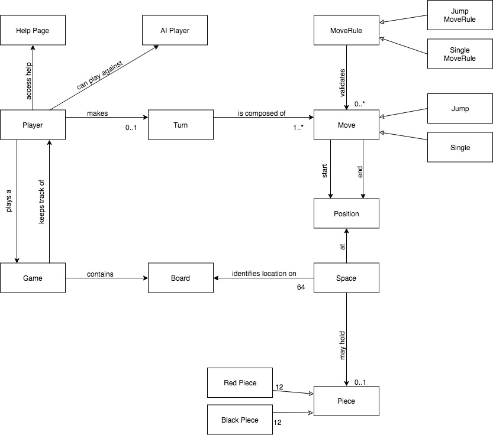

The figure above represents the application domain of the project. As a player, one can access the help page, play against an AI player, or make a turn on a board during a current game. A turn is composed of a move which is then validated by MoveRule to ensure that the move, either a jump or a single, is lawful according to the American rules of Checkers. A move consists of two positions: a start and an end position, and each position corresponds to the coordinates of a space on the game board. A piece can occupy a space on the board and can be either red or white colored depending on the the player.     

## Architecture

### Summary

The following Tiers/Layers model shows a high-level view of the webapp's architecture.

As a web application, the user interacts with the system using a browser.  The client-side
of the UI is composed of HTML pages with some minimal CSS for styling the page.  There is also
some JavaScript that has been provided to the team by the architect.

The server-side tiers include the UI Tier that is composed of UI Controllers and Views.
Controllers are built using the Spark framework and View are built using the FreeMarker framework.  The Application and Model tiers are built using POJOs.

Details of the components within these tiers are supplied below.

### Overview of User Interface

This section describes the web interface flow; this is how the user views and interacts
with the WebCheckers application.

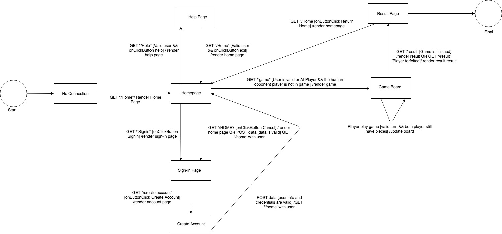

The standard procedure for a user is to first connect to the homepage. This renders the web application interface. From there, the user can click on the Sign-in button, and this will render the sign-in page. On this page, the user will input a valid username. If it is not valid, the user will receive an error message and will be prompted again to enter another username or can choose to go back to the homepage without entering any username.  After entering a username, the player now has the option to enter a game with another online player, play against the AI player, or access the help page to view the rules of Checkers. If player enters a game with either an online player or the AI, they will be directed to game page to start playing a game of Checkers. At this point, the player and their opponent will play a game of checkers until one of them successfully eliminates all the opponent's piece. At that point, they will be redirected to the homepage and receive a message saying if that player has won or lost the game. They can choose to play another game or log out.   

### UI Tier
The UI tier consists of several classes that function as the server side backend. The classes interface and provide hooks from the client side to the server side

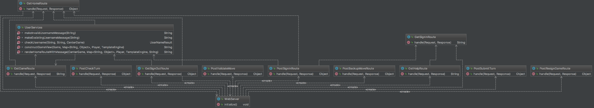

### Application Tier
The Application Tier consists of the PlayerLobby and CenterGame class. The center game class manages an arraylist of available games and creates a lobby for a player using PlayerLobby. It is also used to start the game of checkers with startgame(). The player lobby manages the players waiting for a game.

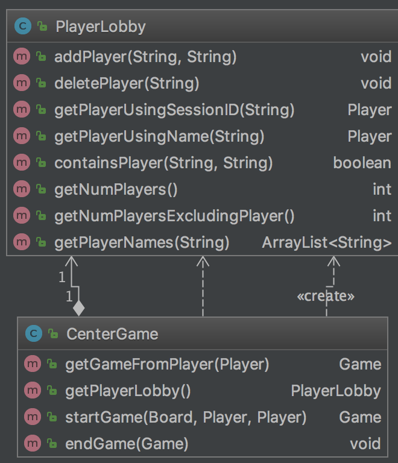

### Model Tier

The model tier for the application, consists of the various game pieces, parts and their functionalities. The foundation of the model tier is the game class. This class interfaces with the board and player classes. The board class in turn interfaces with the row, space, and piece classes. The player class interfaces with the move, moverule, turn, piece and position classes.

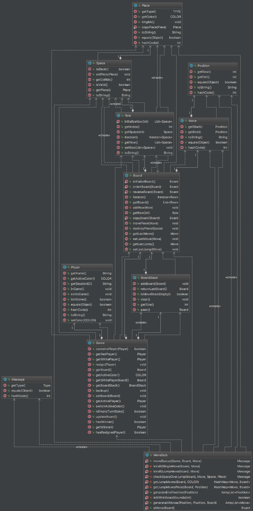

### Enhancement Feature -  AI Player
A user is given the option to play with AI Player along with the human players. Features of AI Player are as follows:
  * Ability to make move autonomous move against human player
  * Follows all the rules of the game
  * Designed an algorithm targeting to win the game against the human player
  * Capture other players piece when possible
  * Ability to become king and make valid moves

### Enhancement Feature - Help Page
Player help is an enhancement feature which provides user with a documentation to play Checkers Game in American Rule. Features that have been included in this enhancement are as follows:
  * Useful resources for the player to initiate moves and capture opponents’ piece
  * Verified rules of American Checkers Game included
  * External engaging resources like Youtube Tutorials are included
  * Future Enhancement: Addition of more useful resources to increase player’s gaming ability. 

### Code Coverage
The code coverage for our WebCheckers Game is around 90%. We tried to do extensive testing for our every class and methods ensuring that everything is working as expected. 

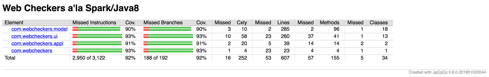

### Code Metrics

#### Lines of Code
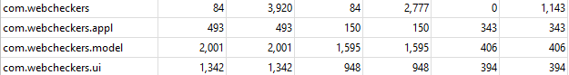

From the lines of code analysis, there is nothing of importance or attention needed that would benefit from a redesign or re-implementation. It makes sense that the model package would contain the most lines of code for the product since it contains all the objects essential to the application. The application package should have the least amount of code since it controls the interaction between the model and UI packages and also the user’s interaction to the application. However, one thing worth mentioning is the lines of code for the test cases. Test classes must be implemented properly to test out all models and events for the program rather than a selected few. Making changes to the size of each of these modules respective to line length would mostly be arbitrary and makes sense the way it is so it would most likely be best to leave this. Of course test classes must be implemented, but that is separate and is just a relative meter in of itself.

#### JavaDoc
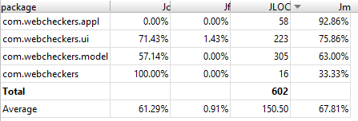
In terms of Javadocs, most of the classes do not have field coverage as you can see from the first column of percentages. A recommendation for this is to include javadocs for any variables or declarations in all the classes declared above; a good method is to have at least 60% in all coverage, and this includes method docstrings. 

#### Martin Packaging
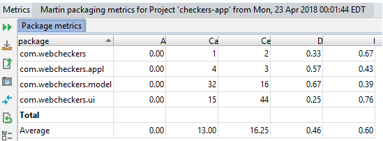
Reading from the abstract (A) column, all packages are reported to be concrete and not depended on any derived or abstract classes, which is appropriate for this application. For the afferent coupling (Ca) column, It makes sense to have the model package to have a high number since most of the classes the model package are objects dependent on the application class and UI in terms of the board and players. For efferent coupling (Ce), the UI package appears to be the most unstable since it has the highest number from the other two. In other words, any changes from the outside classes can have an impact on the UI class in this instance. A recommendation for this instability is to group together code that appears in the same cohesion so that any changes from the external classes would only affect that group of code in which the UI class can use without significantly having to change any of code in the UI classes. Another thing to mention is the normalized distance (D) and instability (I). The application package appears normalized between abstractness and stability while the model package is leaning towards the instability side and the UI package towards the abstract side. I believe no modification should be made due to the fact that the route classes should not be extended since their intended purposes is to send messages back and forth from client to server. For the model class, since it is halfway between normalized and instability, some minor implementation can be made to ensure balance. Overall it would be advisable to at least implement some helper functions in the code, and increase code reuse overall. A lot of classes use information they otherwise shouldn’t have access to, there should be more getters for these things, and there should be additional classes made which be a “middle-man” and transfer data between the two classes, this way to follow information expert, and overall to decrease coupling, increase cohesion.

#### Complexity
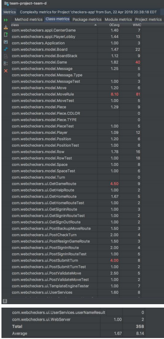
From the complexity analysis, it appears that the MoveRule class contains the highest complexity in terms of following principles and maintaining greater polymorphism. Although this is a static class to test the validity of a move, the code within can be broken down to ensure less complexity and more reusability for other classes to use. For example, codes pertaining to generating moves should immediately be deleted from this class (i.e. aiMoves and getting a list of moves even though they are helper functions). 

#### Chidamber-Kemerer
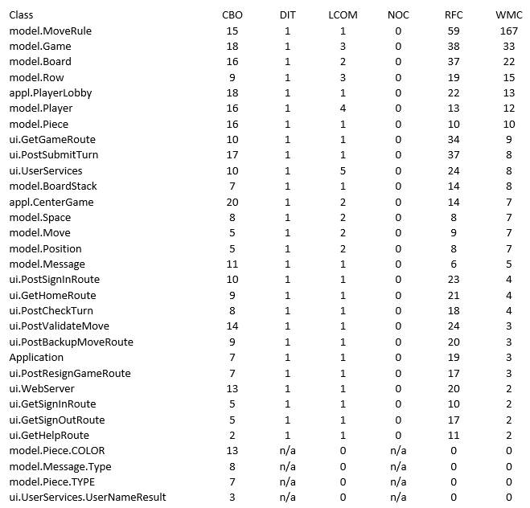
In terms of coupling between objects (CBO), the higher the number, the difficult it is to maintain and test. This means that testing would be harder since this particular class would need these specific objects to ensure if the class works. A recommendation to reduce the high coupling 
The depth of inheritance (DIT) for each class remains low at a value of 1, which also mean no children classes (NOC), which is also at value of 0. This should be the case for the route classes since there should not be any children subbed the main route classes of the application, and also for the application class. In terms of the model classes, there are not that many instances where the classes would have a children since the objects can mostly be comprised of their own entities. 
For lack cohesion of methods (LCOM), the analysis shows low values, with the highest being 5, indicating that there is a high cohesion between classes. No major redesign or re-implementation is needed for this part.

###  Dynamic Behaviors
Few Dynamic Behaviors in our WebCheckers Game are as follows:

#### Sub-system: Current Game
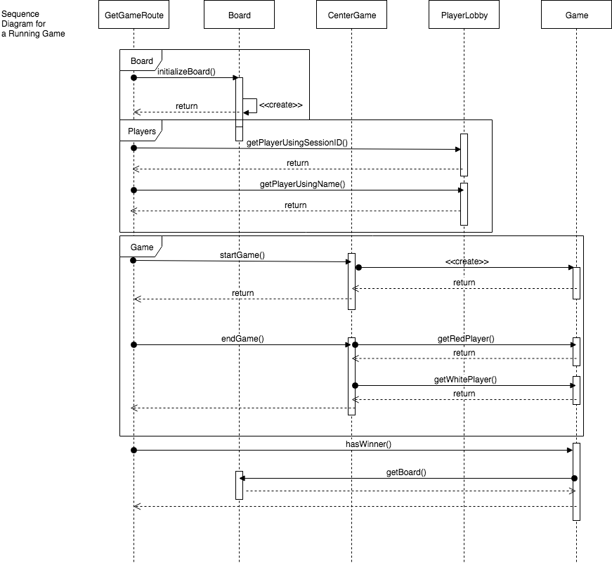
####
This sequence diagram illustrates the flow of a current game from the system retrieving the players from the player list in the PlayerLobby class to playing a game and ending a game. The GetGameRoute object retrieves the player via sessionID and the opponent via their username and also initializes the board from the Board object. This collection is then passed to the Game object where a game will be instantiated and stored in the CenterGame object. During the game, the session will constantly check to see if the game has a winner or not and determine whether to exit the game. 

#### Sub-system: Valid Move
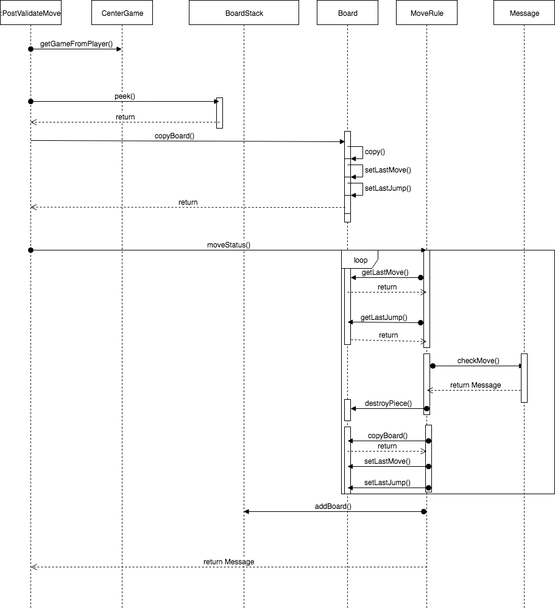
####  
This sequence diagram displays the interactions of objects when validating a player's move. When a move is made on the board, the PostValidateMove object will get the player who has moved a piece and latest board configuration from the BoardStack object. It will then get a copy of the board just in case if the player makes multiple moves in their single turn. Then, the board and the move is checked by the MoveRule object, which will
get the last move made on the board and develop a Message made by the Message object and passed back to the PostValidateMove object to validate the move for the player.